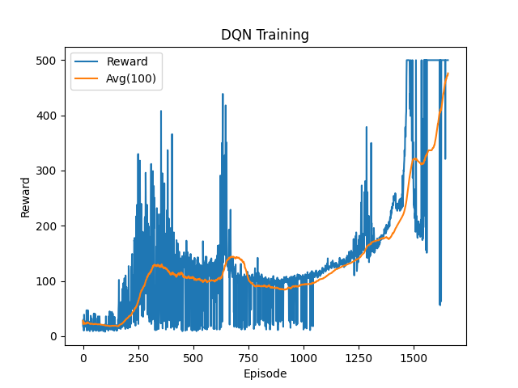

# RL Learning Experiments

This repository documents my journey into **Reinforcement Learning (RL)**, starting from basic control problems and progressing toward robotics and manipulation.

---

##  Goals

* Build a strong intuition for RL algorithms
* Transition from simple environments → robotic simulation (MuJoCo, ROS)
* Connect RL with perception and control

---

## Experiments

### CartPole

* Random agent
* Rule-based controller
* DQN

### LunarLander

* (Planned) DQN implementation
* (Planned) reward analysis

---

##  Setup

```bash
python3 -m venv venv
source venv/bin/activate
pip install -r requirements.txt
```

---

##  What I'm Learning

* Agent–environment interaction
* Exploration vs exploitation
* Value functions and Q-learning
* Neural networks for control

---

## 📊 Results

###  CartPole DQN Training

Below is the reward progression and moving average over episodes:



---
